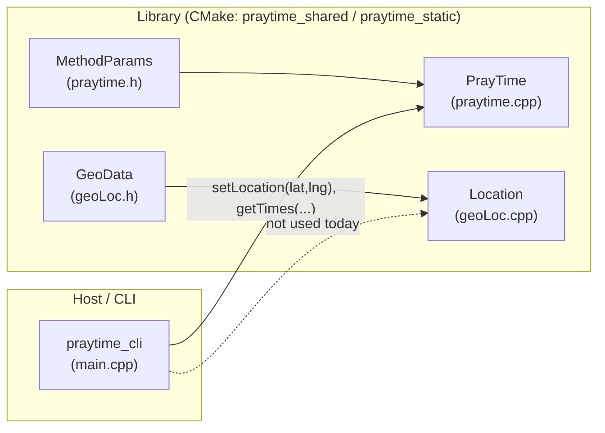
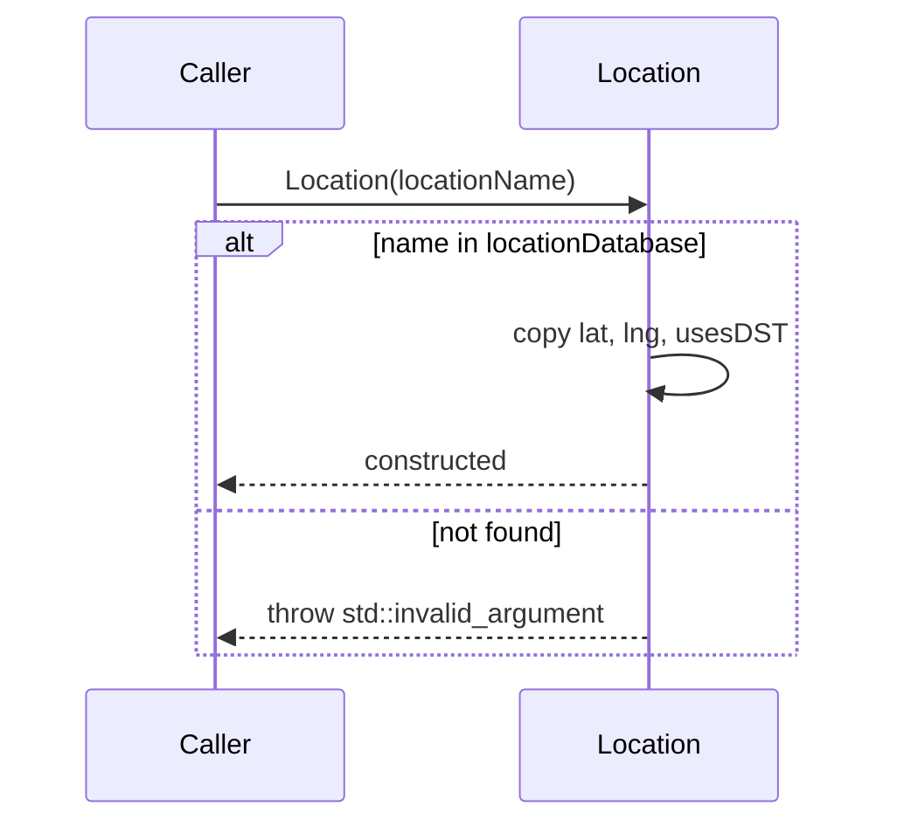
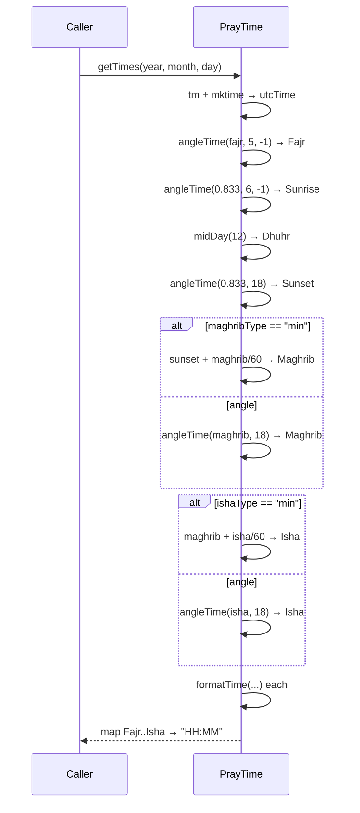
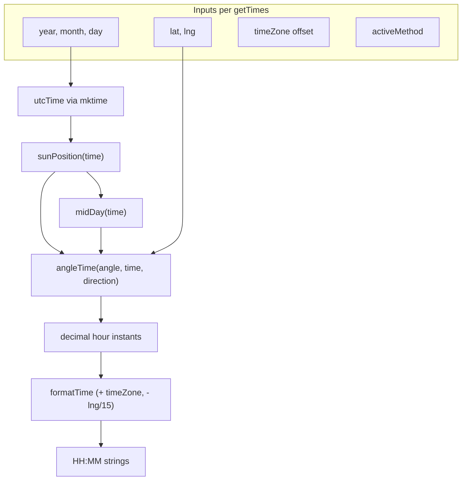

# High-Level Design: Prayer Times and Location (cpraytime)

This document describes the **current** architecture and behavior of the library code under `src/`, primarily `praytime.cpp` and `geoLoc.cpp`, together with their headers. It is written for maintainers and future contributors.

---

## 1. Purpose and context

The codebase provides:

1. `**PrayTime`** — Calculation of Islamic prayer times for a given **calendar date**, using a named **calculation method** (angles and rules for Fajr, Maghrib, Isha, etc.), given **latitude**, **longitude**, and a **manual timezone offset** (hours east of UTC).
2. `**Location`** — Resolution of a **place name** to latitude, longitude, and a **DST observation flag** via a **static in-memory database**. The flag is stored but **not** applied by `PrayTime` in the current implementation.

The CLI (`main.cpp`) uses `**PrayTime` only**; it does not call `Location`. A host application is expected to **compose** `Location` and `PrayTime` if named places are required.

---

## 2. Audience and scope

|                                         |                                                                                                                                                                   |
| --------------------------------------- | ----------------------------------------------------------------------------------------------------------------------------------------------------------------- |
| **Audience**                            | Developers maintaining or extending the C++ library and CLI.                                                                                                      |
| **In scope**                            | `PrayTime` pipeline, method table, solar math helpers, `getTimes` outputs, `Location` lookup and `GeoData`.                                                       |
| **Out of scope (unless added in code)** | Automatic DST offset calculation, high-latitude adjustment logic, external geocoding, Asr (not produced by `getTimes` today), and any persistence or network I/O. |

---

## 3. Module and component view

**Responsibilities**

| Component      | Responsibility                                                                                                                                |
| -------------- | --------------------------------------------------------------------------------------------------------------------------------------------- |
| `PrayTime`     | Register methods, hold active method and geo/time state, compute solar position and prayer times for one day, return labeled `HH:MM` strings. |
| `Location`     | Look up a string key in `locationDatabase`; populate name, lat, lng, `usesDST` or throw `std::invalid_argument`.                              |
| `MethodParams` | Per-method numeric and string parameters (Fajr/Isha angles, Maghrib/Isha interpretation).                                                     |
| `GeoData`      | Per-location latitude, longitude, DST flag.                                                                                                   |

---

## 4. Data model

### 4.1 `MethodParams` (`praytime.h`)

- `**fajr`**, `**isha**`, `**maghrib**` — Used as angles (degrees) or as **minutes after sunset/maghrib** depending on `ishaType` / `maghribType`.
- `**ishaType`**, `**maghribType**` — `"angle"` (default) vs `"min"` to choose between `angleTime(...)` and fixed minute offsets from sunset/maghrib.
- `**midnight**` — Present on the struct; **not read** in the current `praytime.cpp` paths documented here.

### 4.2 Built-in methods (`PrayTime` constructor in `praytime.cpp`)

| Key                 | Role in code (summary)                                                       |
| ------------------- | ---------------------------------------------------------------------------- |
| `MWL`               | Fajr 18°, Isha 17° (angles).                                                 |
| `ISNA`              | Fajr 15°, Isha 15°.                                                          |
| `Egypt`             | Fajr 19.5°, Isha 17.5°.                                                      |
| `Makkah`            | Uses `"min"` types for Maghrib/Isha (values 1.0 and 90.0 as configured).     |
| `Karachi`           | Fajr 18°, Isha 18°.                                                          |
| `Tehran` / `Jafari` | Angle-based with extra struct fields including `midnight` string `"Jafari"`. |

`setMethod` updates `activeMethod` **only if** the method name exists in `methods`; otherwise the previous `activeMethod` remains unchanged (no error).

### 4.3 `GeoData` and `Location::locationDatabase` (`geoLoc.cpp`)

- `**GeoData`**: `latitude`, `longitude`, `usesDST`.
- `**locationDatabase**`: `static const std::unordered_map` initialized at link time with named cities (e.g. New York, London, Tokyo, Tigard, Portland, Beaverton, Clackamas, Lake Oswego, Sydney, Phoenix). Unknown keys throw in the `Location` constructor.

---

## 5. Key workflows

### 5.1 Resolve a place name (`Location`)

### 5.2 Compute prayer times for one day (`PrayTime::getTimes`)

**Outputs** (keys in the returned `std::map`): `Fajr`, `Sunrise`, `Dhuhr`, `Sunset`, `Maghrib`, `Isha`. **Asr** is not computed in the current `getTimes` implementation.

### 5.3 Internal solar pipeline (conceptual)

---

## 6. Astronomical and time model (high level)

- `**sunPosition(time)**` — From day index `D` (using `utcTime`, local `time`, and longitude), derives solar mean anomaly, ecliptic longitude, obliquity, right ascension, then returns **declination** and **equation of time** (as `SunPos`).
- `**midDay(time)`** — Solar noon adjustment: `12 - equation` (wrapped with `fixAngle`).
- `**angleTime(angle, time, direction)**` — Solves for hour angle when the sun is at a given elevation (`angle` in degrees), using declination and observer latitude; combines with `midDay` and `direction` (+1 / -1) for morning vs evening branches where passed explicitly.
- `**formatTime**` — Converts a decimal hour to `HH:MM` after applying `timeZone` and **longitude-based** offset (`- lng / 15.0`), then `fixAngle` into a 0–360°/24h-style range before flooring hours and minutes.

**Assumptions and limitations (as implemented)**

- Timezone is a **single scalar offset**; `Location::usesDST` is **not** consumed by `PrayTime`.
- `**mktime`** interprets the constructed `struct tm` in the **host local timezone**, which affects `utcTime` and thus solar position for that day. Callers should be aware of environment dependence.
- `**setHighLats`** is declared in `praytime.h` but **has no definition** in `praytime.cpp` as of this document; high-latitude behavior is not implemented in this translation unit.

---

## 7. Public API summary

| API                                                | Behavior                                                                  |
| -------------------------------------------------- | ------------------------------------------------------------------------- |
| `PrayTime(method)`                                 | Fills `methods`, calls `setMethod`, `setLocation(0,0)`, `setTimezone(0)`. |
| `setMethod(method)`                                | No-op if key missing; else copies `MethodParams` to `activeMethod`.       |
| `setLocation(lat, lng)`                            | Stores coordinates.                                                       |
| `setTimezone(offset)`                              | Stores hours offset for `formatTime`.                                     |
| `getTimes(y, m, d)`                                | Returns six named times as strings.                                       |
| `Location(name)`                                   | Throws if unknown; else sets fields from database.                        |
| `getName`, `getLatitude`, `getLongitude`, `hasDST` | Read-only accessors.                                                      |

**Thread safety:** `PrayTime` mutates `utcTime` and uses instance fields during `getTimes`; concurrent use of one instance from multiple threads without external synchronization is unsafe.

---

## 8. Integration with the CLI (`main.cpp`)

Today the CLI parses **numeric** `lat`, `lng`, and `method`, constructs `PrayTime`, sets location and a **hard-coded** `setTimezone(-7.0)`, then loops over days in the current month calling `getTimes`. `**Location` is not referenced.** A natural evolution is: `Location loc(argv[...]); pt.setLocation(loc.getLatitude(), loc.getLongitude());` plus a real timezone/DST policy.

---

## 9. Known gaps and follow-ups

| Item                     | Notes                                                                                                                                                                            |
| ------------------------ | -------------------------------------------------------------------------------------------------------------------------------------------------------------------------------- |
| `setHighLats`            | Declared in header, not implemented in `praytime.cpp`.                                                                                                                           |
| `Location` vs `PrayTime` | No compile-time link; composition is caller’s responsibility.                                                                                                                    |
| `usesDST`                | Stored, never passed into `PrayTime`.                                                                                                                                            |
| `MethodParams::midnight` | Set for some methods; unused in current calculation path in `praytime.cpp`.                                                                                                      |
| Sunset call              | `angleTime(0.833, 18)` uses default `direction == 1`; other twilight calls pass `-1`. Document behavior **as coded**; validate against reference tables if accuracy is required. |
| Missing prayer           | **Asr** not in `getTimes` return map.                                                                                                                                            |

---

## 10. Extension hooks (forward-looking)

- **Geolocation:** Replace or supplement `locationDatabase` with geocoding or user-supplied coordinates.
- **Time zones:** Map `Location` + date to offset (IANA TZ DB or platform APIs); optionally apply `usesDST`.
- **High latitudes:** Implement `setHighLats` and document which modes match which fiqh/software references.
- **Output:** Add Asr, midnight, or structured types (e.g. `std::chrono` or minutes since midnight) instead of only strings.
- **Testing:** Golden files per method and fixed (lat, lng, date, offset) for regression.

---

## 11. Appendix: artifact checklist

When maintaining this design alongside the code:

1. Keep **Section 4.2** in sync with the constructor map in `praytime.cpp`.
2. Keep **Section 4.3** in sync with `Location::locationDatabase` in `geoLoc.cpp`.
3. Optionally add a short **sample output** appendix from `praytime_cli` for a known (lat, lng, method, date) as a smoke baseline.

---

*Document generated to reflect the repository layout and sources at the time of writing. Update this file when public APIs or calculation outputs change.*